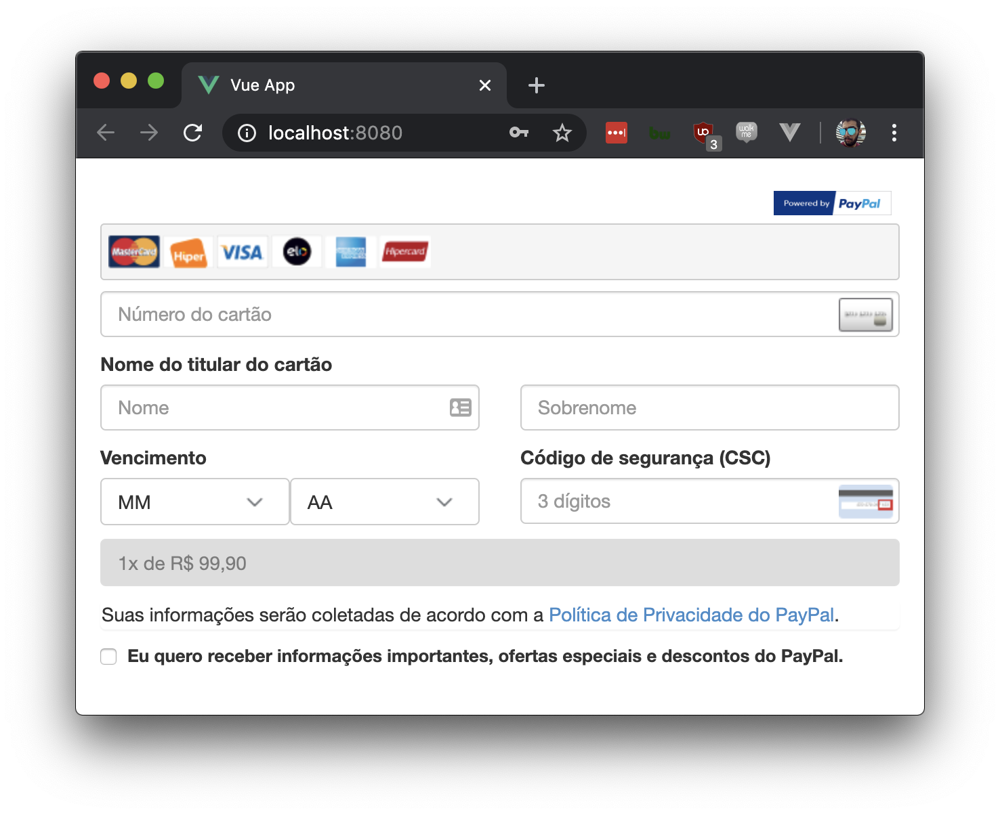

# PayPal Plus for Vue

:warning: **This project does not support Vue 3 yet. Soon I'll work in a fix for that.**

A single-file component made for PayPal Plus (aka PayPal unbranded checkout). Works like PayPal Payment Pro but it was tailored for Brazil and Mexico markets.

##### Important notes:
1. **Be sure** you have PayPal Plus enabled for your account in order to use it on Live environment. Contact PayPal to check and/or enable it. Sandbox environment is enabled for all PayPal accounts. Follow this [Get Started guide](https://developer.paypal.com/docs/api/overview/) from PayPal to create a developer account.
2. It's **highly recommeneded** to use v1 APIs to use PayPal Plus. v2 APIs aren't supported yet (May work? Yes, but I still do not recommend them :sweat_smile:). 
---

### Installation

```
    npm install paypalplus-for-vue
```

### Usage

Import the component to the page you will instance the PayPal Plus frame:

```javascript
    import PaypalPlus from 'paypalplus-for-vue'
```

Then set it as component in parent .vue file:

```javascript
    components: {
        PaypalPlus
    }
```

To load the frame properly you will need to instance the required props:

Prop | Required | Default value | Type | What is it?
--- | --- | --- | --- | ---
`mode` | Yes | live | String | Environment you want to load PayPal Plus. Supported values: `sandbox` or `live`
`approvalUrl` | Yes |  | String | approval_url link returned from v1/payment/payments ([example](https://developer.paypal.com/docs/api/payments/v1/#payment-create-response))
`email` | Yes |  | String | Email address of the payer providing payment information for checkout.
`firstName` | Yes |  | String | First name of the payer providing payment information for checkout. This name must match the name on the credit card.
`lastName` | Yes |  | String | Last name of the payer providing payment information for checkout. This name must match the name on the credit card.
`phone` | No |  | String | Phone number of the payer providing payment information for checkout. Recommended if tangible products are being selled for [PayPal's Seller Protection](https://www.paypal.com/us/webapps/mpp/security/seller-protection).
`language` | No |  | String | Language in which to render the PayPal Plus payment selection page. Allowed values are: `en_US`, `pt_BR`, `es_MX`. It's also automatically defined by defined `country`.
`country` | No | US | String | Country where the PayPal Plus service is deployed. Supported values: `US`, `BR`, `MX`
`taxId` | No | blank | String | **Only required in Brazil**. CPF or CNPJ document of the payer. Must be the the document related to the credit card holder. (only numbers, please).
`domName` | No | ppplus-vue | String | Name of the ID which will load the PayPal Plus frame.
`buttonId` | No | continueButton | String | Button ID that will trigger the payment. This will be disabled/enabled depending on which actions it receives from frame.
`collectBillingAddress` | No | false | Boolean | If set to true address fields Line1, Line2 *(optional)*, City, Postal Code, Country and State are collected through frame. **Not required if `BR` or `MX` -- automatically applied if `US`**.
`mxDebitCards` | No | false | Boolean | If `true` and if the buyer is Mexican, debit card logos are not displayed.
`iframeHeight` | No | 550 | String | Set the height size of PayPal Plus frame. 
`rememberCards` | No | false | Boolean | Enable the option to remember payer's card. 
`rememberedCards` | No |  | String | When a payment is properly executed, rememberCards is set as `true` and payer selected this option, a hash containing the card used on this transaction is generated. You need to securely store this hash to this user and inform this hash anytime he instances PayPal Plus.
`blockinstallment` | No | false | Boolean | Block installment selection on PayPal Plus frame. 
`installmentTerm` | No | 0 | Number | Sets a static number of installments. Useful if you set `blockInstallment` so he can't change the installment provided (before or by store's default).
`noScript` | No | false | Boolean | By default this component already append a script containing the [PayPal Plus frame library](https://developer.paypal.com/docs/integration/paypal-plus/mexico-brazil/integrate-a-payment-selection-page/#embed-an-iframe). If you are using another way to load external scripts (such as [vue-plugin-load-script](https://www.npmjs.com/package/vue-plugin-load-script)) it's recommended to set this prop.
`pppDebug` | No | false | Boolean | Logs on console each action received from PayPal Plus frame. 


You'll need also to listen these two events on PayPal Plus component. 

Event | Why?
--- | ---
`@checkout` | Receive a function to execute when a payment is approved. Data containing event details is sent. 
`@error` | Receive a function to execute when a payment went wrong. Data containing event details is sent. 

Inside template you will call the paypal-plus tag:

```html
<!-- sandbox example below -->
<template>
    <paypal-plus
      ref="ppplus"
      mode="sandbox"
      approvalUrl="https://www.sandbox.paypal.com/cgi-bin/webscr?cmd=_express-checkout&token=EC-65N73270YN200541T"
      firstName="Renan"
      lastName="Araujo"
      country="BR"
      taxId="27374114087"
      email="renan9379@sandboxpaypal.com"
      @checkout="onContinue"
      @error="onError" 
    />
</template>
```

If all this were set good, this frame may show:



### Listening payment button

Unfortunately **triggerbus** did not fit properly to listen button as a Vue SFC (creating through [vue-sfc-rollup](https://github.com/team-innovation/vue-sfc-rollup)). So the best way now to make it work is... 
Include a `ref` prop (*i.e.* `ppplus` as above)  inside `paypal-plus` component and then register a method to execute this referenced component function named **pppContinue**.

```javascript
// Checkout.vue

methods: {
    handleCheckout() {
        this.$refs.ppplus.pppContinue();
    }
}

```

```javascript
// Checkout.vue

<custom-button on:click="handleCheckout">Checkout</custom-button>

```

Soon a better way to threat it will be found, I promise. :crossed_fingers:

### Treating payment execution or error

As previously informed you need to register two listeners on component (`@checkout` and `@error`). If everything went good and the payment is approved you need to call the [PayPal API v1/payments/payment/{transaction-id}/execute](https://developer.paypal.com/docs/api/payments/v1/#payment-create-response) to actually execute this payment. 

On first example I did declared the `@checkout` function to be triggered is named **onContinue**. So I did register a method with this name that receives the data from checkout event meaning that the payment was approved. Based on PayPal API's I do need to info the payerId to the API (or my backend that does that) to execute this payment. 


```javascript
// Checkout.vue

methods: {
    onContinue(data) {
        let payerId = data.payer.payer_info.payer_id
        axios.post('/my/backend/paypal/execute', 
            { payer_id: payerId } 
        }).then((res) => {
            /* Execute something when Promise is resolved */
        })
    }
}

```

It's also needed to create a method to handle errors that may happen when things did not went good with tried payment. On my example I've registered a method named **onError** and then -- as the same that my onContinue did -- it needs to receive a data to treat the error according on what frame informed as error. 

[PayPal provides an error list](https://developer.paypal.com/docs/integration/paypal-plus/mexico-brazil/test-your-integration-and-execute-the-payment/#handling-errors) with the most common errors that you need to handle. Some of these errors ask you to generate a new ecToken (or `approvalUrl`) so on these errors you need to call v1/payments/payment again to generate a new link and load PayPal Plus component again. 


> *I do highly recommend you to re-render PayPal Plus component when **any** error is triggered. One way to do that is attaching a componentKey as component prop -- [as explained on this article](https://michaelnthiessen.com/force-re-render/)*

```javascript
// Checkout.vue

data() {
    return {
        componentKey: 0
    }
},

```


```javascript
// Checkout.vue

methods: {
    onError(data) {
        let error = data.error;
        switch(error) {
            case 'TRY_ANOTHER_CARD':
                alert('Please try another card in order to execute your payment.')
                this.componentKey += 1
        }
    }
}

```

That's it. :tada: 

Please let me know if any bug or issue may happed with this component. 
